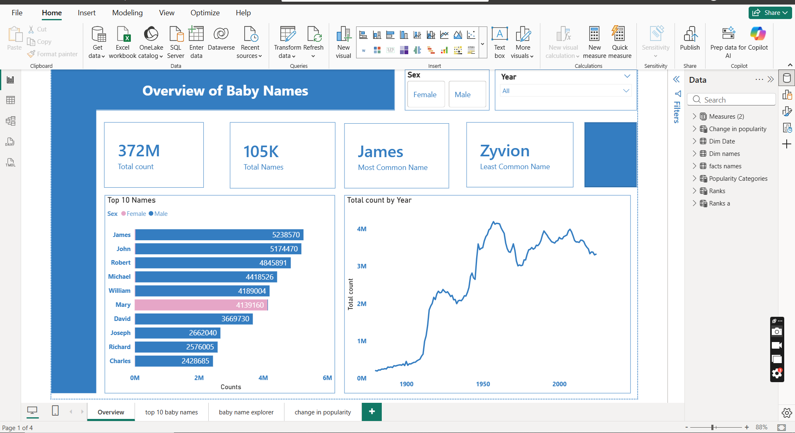
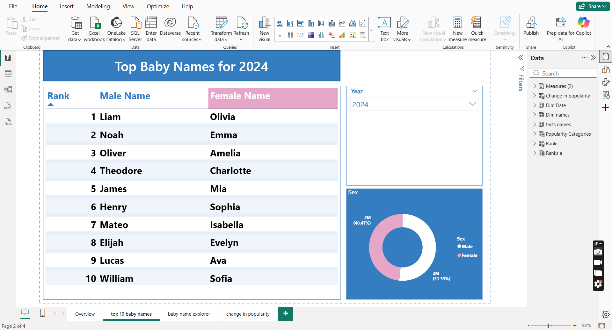
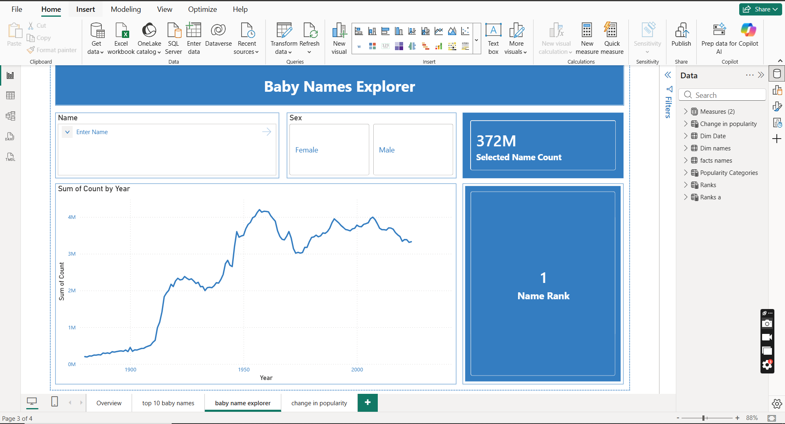
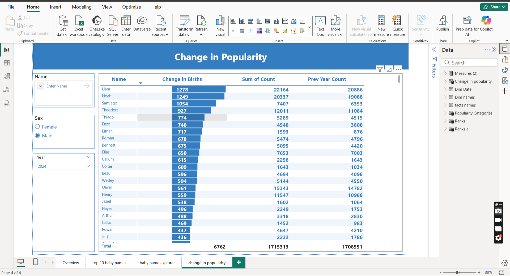
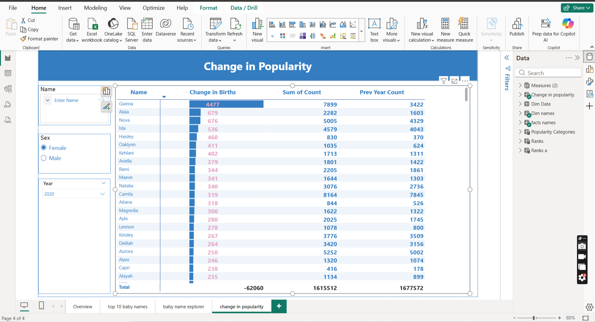

# 📊 Baby Names Analytics Dashboard (SSA-Inspired)
**By Osekhuemen Peter-Imoisili**



---

## 🧠 Project Story

I came across the baby names dataset on data.gov — a ZIP file packed with yearly `.txt` files going all the way back to 1880. Alongside it was a link to the SSA website, and the moment I opened it, one thing stood out immediately: it wasn't just data, it was *interactive*.

That's what inspired this project.

Instead of building a static dashboard that just sits there looking pretty, I wanted to recreate that experience in Power BI — something users can actually explore and play with. And to do it properly, I built a full pipeline from raw data to final visualisation. No shortcuts.

---

## 🎯 Objective

Build a fully interactive analytics dashboard that allows users to:
- Search any name and track its popularity over time
- Compare male vs female name trends side by side
- Identify rising and declining names dynamically
- Explore naming patterns across decades

Basically — turn 140 years of raw data into something people can actually use.

---

## 🏗 Data Pipeline (End-to-End)

This project wasn't just a Power BI exercise. Here's how the data actually moved:

```
data.gov (ZIP file)
      ↓
Python (Ingestion + Transformation)
      ↓
CSV (Processed Data)
      ↓
SQL Database (Storage + Validation)
      ↓
Power BI (Interactive Dashboard)
```

### 🔹 Data Source
- Downloaded from [data.gov](https://www.data.gov)
- Provided as a ZIP file containing individual `.txt` files for each year (e.g. `yob1880.txt`, `yob2023.txt`)
- Each file contains: Name, Gender, Count

### 🔹 Data Processing — Python
- Looped through all yearly `.txt` files
- Added a `Year` column derived from each filename
- Combined all files into one structured dataset
- Exported to a clean CSV for downstream use

### 🔹 Data Storage — SQL
- Loaded cleaned data into a SQL database
- Designed a star schema with fact and dimension tables
- Ran validation queries to confirm accuracy before connecting to Power BI
- Cross-checked SQL query results against Power BI visuals to ensure consistency

*(Yes — I didn't just trust Power BI blindly 😄)*

### 🔹 Data Visualization — Power BI Desktop
- Built an interactive dashboard inspired by the SSA website experience
- Implemented dynamic DAX measures for ranking, filtering, and trend analysis

---

## 🗂 Data Model

Star schema design:

**Fact Table — `fact_baby_names`**
| Column | Description |
|--------|-------------|
| name_id | Foreign key to dim_names |
| year | Year of record |
| count | Number of births |

**Dimension Table — `dim_names`**
| Column | Description |
|--------|-------------|
| name_id | Primary key |
| name | Baby name |
| sex | Gender (M/F) |

**Engineered Column:**
- `Decade` — derived from year for decade-level analysis

---

## 📊 Dashboard Pages

The report has 4 interactive pages:

---

### Page 1 — Overview of Baby Names
The high-level summary page. At a glance:
- **372M** total births recorded
- **105K** unique names in the dataset
- **James** — most common name of all time (5.2M births)
- **Zyvion** — least common name in the dataset
- Top 10 all-time names bar chart
- Total births by year line chart spanning 1880 to present — the 1950s baby boom is clearly visible

---

### Page 2 — Top Baby Names
Side-by-side male and female ranking table, filterable by year. Top 5 for 2024:

| Rank | Male | Female |
|------|------|--------|
| 1 | Liam | Olivia |
| 2 | Noah | Emma |
| 3 | Oliver | Amelia |
| 4 | Theodore | Charlotte |
| 5 | James | Mia |

Includes a gender donut chart — 51.53% male vs 48.47% female births in 2024.

---

### Page 3 — Baby Name Explorer
The core interactive feature. Search any name, filter by gender, and instantly see:
- Full popularity trend line from 1880 to present
- Current name rank
- Total selected name count (372M shown when no filter applied)

Replicates the SSA website experience directly in Power BI.

---

### Page 4 — Change in Popularity
The most analytically advanced page. Shows which names gained or lost the most births year-over-year with three columns: Change in Births, Sum of Count, and Prev Year Count.

Example findings:
- In 2020, **Gianna** had the highest female birth increase (+4,477)
- In 2024, **Liam** led male name growth (+1,278), followed by **Noah** (+1,249)
- In 2024 for females, **Ailany** led with +2,285 new births over the prior year

---

## 📏 Key Metrics

| Metric | Description |
|--------|-------------|
| Total Births | 372M across all years and names |
| Unique Names | 105K distinct names in the dataset |
| Most Common Name | James (5.2M births all time) |
| Least Common Name | Zyvion |
| Name Rank | Dynamic rank based on active filters |
| Change in Births | Year-over-year birth count difference |
| Prev Year Count | Previous year births for comparison |

---

## ⚠️ Challenges & Solutions

**Ranking always returned 1**
Fixed by adjusting DAX filter context — switched from `ALLSELECTED()` to `ALL()` to ensure comparison across the full name list, not just the filtered selection.

**Duplicate names appearing in ranking table**
Implemented tie-breaking logic in DAX to guarantee unique rank assignment even when counts were identical.

**Aligning male and female rankings in one table**
Created a helper rank table and used calculated measures to map names correctly per rank position across both genders.

**Making Power BI feel like a web app**
Used slicers, dynamic titles, and context-aware DAX measures to simulate the interactive behaviour of the SSA website.

---

## 🧠 What I Learned

- How filter context in DAX actually works (this one humbled me 😅)
- Building ranking systems that hold up under edge cases
- Why validating dashboards against SQL queries matters
- Designing reports for *user interaction*, not just visual presentation

---

## 🛠 Tools & Technologies

| Tool | Purpose |
|------|---------|
| Python (pandas) | Data ingestion and transformation |
| SQL | Data storage, modelling, validation |
| Power BI Desktop | Interactive dashboard |
| DAX | Measures, rankings, dynamic filtering |

---

## 📁 Repository Structure

```
baby-names-analytics/
├── data/
│   ├── raw/                  # Original .txt files from data.gov
│   └── processed/            # Cleaned CSV ready for analysis
├── python/
│   └── pipeline.ipynb        # Data ingestion and transformation notebook
├── sql/
│   └── queries.sql           # Schema creation and analysis queries
├── powerbi/
│   └── baby_names_dashboard.pbix
├── images/
│   ├── Dashboard_overview.png
│   ├── Top_baby_names.png
│   ├── baby_name_explorer.png
│   ├── change_in_popularity.png
│   ├── change_in_popularity_female.png
│   └── change_in_popularity_2020.png
└── README.md
```

---

## 🚀 How to Run

1. Clone the repo:
```bash
git clone https://github.com/lovveday/baby-names-analytics.git
```

2. Open `python/pipeline.ipynb` in Jupyter and run all cells to regenerate the cleaned CSV

3. Run `sql/queries.sql` in pgAdmin or DBeaver to set up and explore the database

4. Open `powerbi/baby_names_dashboard.pbix` in Power BI Desktop

---

## 💡 Future Improvements

- Side-by-side comparison of two names
- Predictive trend analysis using time-series forecasting
- Public deployment of dashboard for open access

---

## 📷 Dashboard Preview




---

## 🎥 Demo Video

👉 [Watch the full dashboard walkthrough on YouTube](https://youtu.be/Ktyg1ylt0c4)

---

## 🔗 Data Source

[Baby Names from Social Security Card Applications — data.gov](https://catalog.data.gov/dataset/baby-names-from-social-security-card-applications-national-data)
